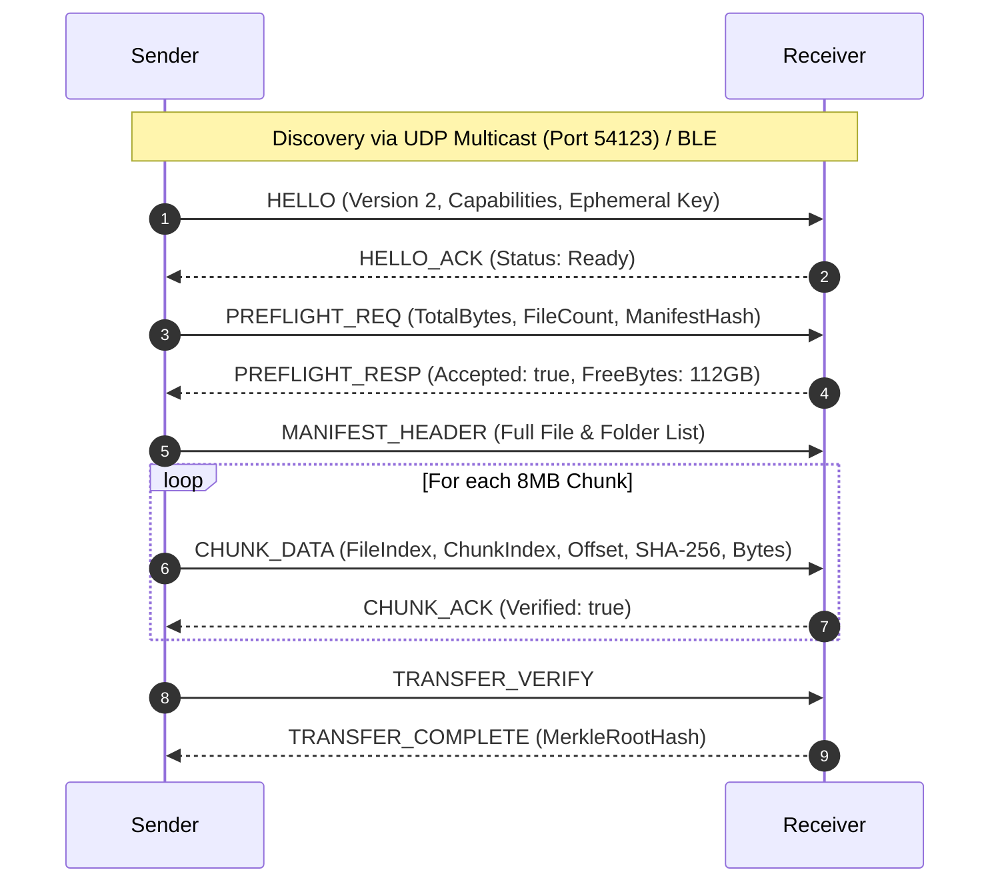

# KnowToMigrate — Wire Protocol Specification (KTM v2.0)

## Framing Specification

Every message sent across TCP or WebRTC data channels starts with a 50-byte binary header followed by an encrypted or raw payload.

```
+-------------------------------------------------------------+
| KTM2 (4B) | Version (1B: 0x02) | Type (1B) | Seq (4B BE)    |
| SessionId (32B Hex ASCII)                                   |
| PayloadLength (4B BE) | CRC32 (4B BE)                       |
+-------------------------------------------------------------+
| Payload: AES-256-GCM [12B IV + 16B Tag + Ciphertext]        |
+-------------------------------------------------------------+
```

## Handshake & Streaming Sequence



## Large File Chunking Strategy
- Standard Chunk Size: 8 MB (`8,388,608 bytes`).
- Streamed sequentially or in parallel workers with backpressure.
- Memory usage is strictly bounded: memory usage does not exceed 16 MB regardless of file size (10 GB, 100 GB, or 1 TB+).
- Each chunk contains an individual SHA-256 digest.

## Interrupted Transfer Resume
- If the network drops at chunk 450 of 1,000, both sides record the verified chunk bitset in `.ktm-checkpoint.json`.
- Upon reconnect, the sender sends `SESSION_RESUME`. The receiver responds with missing chunk indices.
- Chunks 1 to 450 are NOT re-transferred. Streaming continues instantly from chunk 451.
